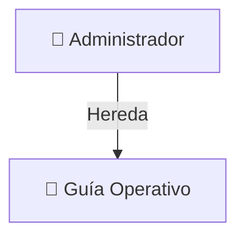

# 📋 Especificación de Casos de Uso
## **Sistema de Gestión de Visitas — Túnel Subfluvial**

Casos de Uso del sistema de visitas del Túnel Subfluvial, Documentación para el mantenimiento y futuras expansiones.

---

## 👥 Resumen de Actores y Permisos
El sistema cuenta con un control de acceso basado en roles (RBAC) gestionado a través de un token JWT firmado por el backend. Los actores del sistema son:

1. **Guía Operativo (Operador):** Responsable de la atención diaria, registro de delegaciones, cancelaciones y edición de turnos.
2. **Administrador:** Hereda todos los permisos del Guía Operativo y tiene acceso exclusivo a la gestión de personal (usuarios), configuraciones del sistema, parámetros operativos de aforo, auditoría y reportes gerenciales.



---

## 🗺️ Mapa de Casos de Uso

El diagrama representa visualmente las interacciones de los actores con las funcionalidades del sistema:

```mermaid
leftToRightDirection
actor Guia as "👤 Guía (Operador)"
actor Admin as "👑 Administrador"

rectangle "Sistema de Gestión de Visitas" {
    %% Casos de Uso - Guía
    usecase CU001 as "CU-001: Autenticarse"
    usecase CU002 as "CU-002: Ver Dashboard / Grilla diaria"
    usecase CU003 as "CU-003: Registrar Visita"
    usecase CU004 as "CU-004: Modificar Visita"
    usecase CU005 as "CU-005: Cancelar Visita"
    usecase CU006 as "CU-006: Gestionar Gestores"
    usecase CU007 as "CU-007: Ver Historial / Listados"
    usecase CU008 as "CU-008: Exportar Confirmación PDF"
    usecase CU016 as "CU-016: Gestionar Mi Perfil"

    %% Casos de Uso - Admin
    usecase CU009 as "CU-009: Gestionar Usuarios"
    usecase CU010 as "CU-010: Configurar Sistema"
    usecase CU011 as "CU-011: Gestionar Días Inhábiles"
    usecase CU012 as "CU-012: Generar Estadísticas"
    usecase CU013 as "CU-013: Ver Logs de Auditoría"
    usecase CU014 as "CU-014: Dashboard Administrativo"
    usecase CU015 as "CU-015: Configurar Visitas y Aforo"
}

Admin --|> Guia

Guia --> CU001
Guia --> CU002
Guia --> CU003
Guia --> CU004
Guia --> CU005
Guia --> CU006
Guia --> CU007
Guia --> CU008
Guia --> CU016

Admin --> CU009
Admin --> CU010
Admin --> CU011
Admin --> CU012
Admin --> CU013
Admin --> CU014
Admin --> CU015
```

---

## 📊 Matriz de Casos de Uso

| ID | Caso de Uso | Actor | Estado | Componente Frontend | Ruta Backend / Controller / Service |
| :--- | :--- | :--- | :--- | :--- | :--- |
| **CU-001** | Autenticarse | Guía, Admin | **Completo** | `Login.tsx`<br>`AuthContext.tsx` | `POST /api/auth/login`<br>`AuthController.login` |
| **CU-002** | Ver Dashboard | Guía, Admin | **Completo** | `Dashboard.tsx`<br>`Calendario.tsx` | `GET /api/visitas` (filtrado por fecha)<br>`VisitaController.getVisitas` |
| **CU-003** | Registrar Visita | Guía, Admin | **Completo** | `RegistroVisita.tsx`<br>`UbicacionSelector.tsx` | `POST /api/visitas`<br>`VisitaController.createVisita` |
| **CU-004** | Modificar Visita | Guía, Admin | **Completo** | `EditarVisita.tsx` | `PUT /api/visitas/:id`<br>`VisitaController.updateVisita` |
| **CU-005** | Cancelar Visita | Guía, Admin | **Completo** | `DetalleVisita.tsx`<br>`ListadoVisitas.tsx` | `PATCH /api/visitas/:id/cancelar`<br>`VisitaController.cancelarVisita` |
| **CU-006** | Gestionar Gestores | Guía, Admin | **Completo** | `Gestores.tsx` | `/api/gestores` (CRUD)<br>`GestorController` |
| **CU-007** | Ver Historial | Guía, Admin | **Completo** | `ListadoVisitas.tsx` | `GET /api/visitas/historial`<br>`VisitaController.getHistorial` |
| **CU-008** | Exportar Confirmación PDF | Guía, Admin | **Completo** | `DetalleVisita.tsx`<br>`Listado.tsx` | `GET /api/estadisticas/exportar/visita/:id`<br>`ExportController.exportarComprobanteVisita` |
| **CU-009** | Gestionar Usuarios | Admin | **Completo** | `GestionUsuarios.tsx` | `/api/usuarios` (CRUD)<br>`UsuarioController` |
| **CU-010** | Configurar Sistema | Admin | **Completo** | `Configuraciones.tsx` | `/api/configuracion` (CRUD)<br>`ConfiguracionController` |
| **CU-011** | Días Inhábiles | Admin | **Completo** | `Configuraciones.tsx` | `/api/dias-inhabiles` (CRUD)<br>`DiaInhabilController` |
| **CU-012** | Generar Estadísticas | Admin | **Completo** | `DashboardAdmin.tsx` | `/api/estadisticas/admin`<br>`EstadisticasController` |
| **CU-013** | Ver Logs de Auditoría | Admin | **Completo** | `Auditoria.tsx` | `/api/auditoria`<br>`AuditoriaController` |
| **CU-014** | Dashboard Admin | Admin | **Completo** | `DashboardAdmin.tsx` | `/api/estadisticas/admin`<br>`EstadisticasController` |
| **CU-015** | Configurar Visitas | Admin | **Completo** | `Configuraciones.tsx` | `/api/configuracion` (CRUD)<br>`ConfiguracionController` |
| **CU-016** | Gestionar Mi Perfil | Guía, Admin | **Completo** | `ModalMiPerfil.tsx` | `/api/usuarios/:id/perfil`<br>`/api/usuarios/:id/password` |

---

## 📖 Especificación Detallada de Casos de Uso

### **CU-001: Autenticarse**
* **Actor:** Guía Operativo, Administrador.
* **Descripción:** Permite el ingreso seguro a la aplicación mediante credenciales validadas.
* **Flujo Principal:**
  1. El usuario accede a la pantalla de Login e ingresa su correo electrónico y contraseña.
  2. Al presionar "Iniciar Sesión", el frontend envía una petición POST a `/api/auth/login`.
  3. El backend verifica que el usuario exista, esté marcado como `activo` y que la contraseña sea correcta (comparando el hash bcrypt).
  4. El servidor genera y retorna un token JWT que expira según la configuración de la sesión del sistema.
  5. El frontend almacena el token en el contexto de autenticación (`AuthContext.tsx`) y redirige al Dashboard.
* **Reglas de Negocio / Validaciones:**
  * **Inactividad:** El sistema inicia un temporizador de inactividad que advierte al usuario 1 minuto antes de expirar la sesión (según lo configurado en `configuracion` de aforo/timeout) y luego destruye el token local redirigiendo al login.
  * **Acceso bloqueado:** Si el usuario no está marcado como `activo` en la base de datos, el backend deniega el acceso con código `401`.

---

### **CU-002: Ver Dashboard**
* **Actor:** Guía Operativo, Administrador.
* **Descripción:** Proporciona una interfaz visual diaria estructurada en grilla interactiva para supervisar los turnos y la ocupación en tiempo real.
* **Flujo Principal:**
  1. Al iniciar la sesión, el usuario ingresa al Dashboard (`Dashboard.tsx`).
  2. El sistema realiza una petición GET a `/api/visitas` enviando la fecha seleccionada (por defecto la de hoy).
  3. El sistema renderiza los slots horarios de visitas (de 08:00 a 17:30, bloqueando el slot de las 18:00).
  4. Los turnos muestran el estado de las visitas mediante colores codificados (Verde = Agendada, Azul = Realizada, Rojo = Cancelada).
  5. El usuario puede cambiar la fecha visualizada utilizando un calendario integrado.

---

### **CU-003: Registrar Visita**
* **Actor:** Guía Operativo, Administrador.
* **Descripción:** Permite agendar una visita ingresando datos del grupo, del gestor y de procedencia geográfica, validando aforo y solapamiento de forma concurrente.
* **Flujo Principal:**
  1. El usuario presiona "Nueva Visita" en el Dashboard o Calendario.
  2. El frontend muestra el formulario estructurado (`RegistroVisita.tsx`).
  3. El usuario completa los datos básicos (Fecha, Hora de Inicio, Tipo de Visita, Cantidad de Personas).
  4. Se selecciona un Gestor existente o se crea uno nuevo "en caliente" (nombre, teléfono, email, empresa).
  5. Se define el Tipo de Visitante:
     * **Institución:** Requiere nivel educativo, provincia, localidad (integrado con el componente `UbicacionSelector.tsx` utilizando la API de Georef).
     * **Particulares:** Requiere tipo de grupo (Menores, Adultos, Mixto) y procedencia (localidad, provincia).
  6. Al enviar el formulario, el backend corre validaciones de disponibilidad (`AvailabilityService`):
     * Verifica que la fecha no sea un **Día Inhábil**.
     * Compara el aforo máximo diario acumulado (`capacidad_maxima`) contra la cantidad solicitada.
     * Valida que no exista solapamiento horario (no más de una visita por slot).
  7. El backend guarda la visita y registra de forma inmutable la acción en la tabla de auditorías.
* **Validaciones Clave:**
  * **Cruce de Túnel:** Campo booleano para definir si la delegación cruza el túnel.
  * **Accesibilidad:** Campo de accesibilidad especial con campo detallado obligatorio si se activa la bandera de discapacidad.

---

### **CU-004: Modificar Visita**
* **Actor:** Guía Operativo, Administrador.
* **Descripción:** Permite actualizar información de una reserva registrada, recalculando las restricciones del sistema si se altera la agenda.
* **Flujo Principal:**
  1. El usuario accede al detalle de una visita y selecciona "Editar Visita" (`EditarVisita.tsx`).
  2. Modifica los campos necesarios (por ejemplo, observaciones, aforo, o la fecha/hora).
  3. Al guardar, si se modificó el día o la hora de la reserva, el backend valida de nuevo la disponibilidad (excluyendo el ID actual de la visita para evitar autofalsas alarmas de solapamiento).
  4. Si pasa los controles, guarda en la base de datos y añade un registro de auditoría con la acción de modificación.

---

### **CU-005: Cancelar Visita**
* **Actor:** Guía Operativo, Administrador.
* **Descripción:** Permite anular una visita liberando el slot horario y el aforo diario asignado de forma inmediata.
* **Flujo Principal:**
  1. En la vista de detalle o desde el historial, el usuario presiona "Cancelar Visita".
  2. El sistema muestra un aviso de confirmación (`window.prompt`) solicitando el motivo de la cancelación.
  3. Al confirmar, el frontend hace una petición PATCH a `/api/visitas/:id/cancelar`.
  4. El backend cambia el estado de la visita a `'Cancelada'`, registra el motivo en la base de datos, y escribe la entrada correspondiente en auditoría.
  5. El slot horario se libera visualmente en el Dashboard.

---

### **CU-006: Gestionar Gestores**
* **Actor:** Guía Operativo, Administrador.
* **Descripción:** Módulo CRUD para administrar la información de los gestores que representan a las delegaciones e instituciones.
* **Flujo Principal:**
  1. El usuario ingresa a "Gestores" (`Gestores.tsx`).
  2. Puede visualizar un listado con búsqueda y paginación.
  3. Es posible registrar un gestor indicando Nombre, Teléfono, Correo y Empresa.
  4. Cuenta con edición persistente en línea y bajas. El backend valida restricciones como unicidad de correos electrónicos.

---

### **CU-007: Ver Historial de Visitas**
* **Actor:** Guía Operativo, Administrador.
* **Descripción:** Permite a los usuarios consultar y auditar el histórico global de visitas mediante un buscador parametrizado.
* **Flujo Principal:**
  1. El usuario navega a la sección de Historial (`ListadoVisitas.tsx`).
  2. Se carga un listado tabular paginado de todas las visitas en la base de datos.
  3. El usuario puede filtrar por rango de fechas, texto de búsqueda rápida (nombre de institución/gestor) y estado de la visita.
  4. Desde esta grilla, el usuario puede acceder directamente a los detalles (`DetalleVisita.tsx`), editar, o cancelar.

---

### **CU-008: Exportar Confirmación PDF (Comprobante Individual)**
* **Actor:** Guía Operativo, Administrador.
* **Descripción:** Genera de forma automatizada un PDF formal de confirmación de turno (comprobante individual) con membrete oficial del Túnel.
* **Flujo Principal:**
  1. Desde la pantalla de `DetalleVisita.tsx` o desde `Listado.tsx`, el usuario presiona "Reimprimir Comprobante" o "Imprimir Comprobante".
  2. El frontend realiza una llamada GET a `/api/estadisticas/exportar/visita/:id`.
  3. El backend utiliza Puppeteer para compilar la información de la reserva, del gestor y del grupo, renderizando un HTML dinámico que se exporta a PDF.
  4. El PDF se transmite en crudo (Blob) al navegador, forzando la descarga del archivo con la nomenclatura `Comprobante_visita_DD-MM-AAAA.pdf`.

---

### **CU-009: Gestionar Usuarios**
* **Actor:** Administrador.
* **Descripción:** Permite al administrador controlar los accesos del personal al sistema mediante alta, edición de perfiles, y desactivación/reactivación.
* **Flujo Principal:**
  1. El administrador accede a la pestaña de Usuarios (`GestionUsuarios.tsx`).
  2. **Alta:** Rellena los datos de Nombre, Email, Contraseña (validando requisitos de seguridad) y Rol (Guía/Admin).
  3. **Edición:** Permite modificar datos personales (Nombre, Email, Teléfono) y rol.
  4. **Desactivación/Reactivación:** Se realiza mediante bajas lógicas que cambian la bandera `activo` (1 ó 0).
* **Validación de Seguridad:**
  * Un administrador no puede desactivarse a sí mismo en el panel (el sistema bloquea esta acción en backend retornando un error para proteger el acceso administrativo general).

---

### **CU-010: Configurar Parámetros del Sistema**
* **Actor:** Administrador.
* **Descripción:** Edición dinámica de configuraciones operativas globales guardadas en un esquema llave-valor.
* **Flujo Principal:**
  1. El administrador accede al panel de Configuraciones (`Configuraciones.tsx`).
  2. Modifica valores como el timeout de sesión por inactividad o la tolerancia de turnos.
  3. Al confirmar, el sistema guarda en la tabla `configuracion` y los cambios aplican en tiempo real en la lógica del backend.

---

### **CU-011: Gestionar Días Inhábiles**
* **Actor:** Administrador.
* **Descripción:** Bloqueo de días en el calendario para inhabilitar reservas en fechas festivas o de mantenimiento preventivo.
* **Flujo Principal:**
  1. El administrador ingresa a Días Inhábiles en Configuraciones.
  2. Selecciona una fecha del calendario, define un motivo y la agrega.
  3. El backend valida que la fecha no sea anterior a hoy y la persiste en `dias_inhabiles`.
  4. En el dashboard y grilla de visitas, este día queda inhabilitado. El validador de disponibilidad rechaza cualquier intento de agendar.

---

### **CU-012 / CU-014: Dashboard Administrativo y Estadísticas**
* **Actor:** Administrador.
* **Descripción:** Panel gerencial con KPIs consolidados mensuales o por rangos de fecha seleccionados.
* **Flujo Principal:**
  1. El administrador ingresa a Estadísticas (`DashboardAdmin.tsx`).
  2. El sistema carga métricas acumuladas del mes en curso:
     * Cantidad total de Visitas y de Personas Recibidas.
     * Total de Cruces de Túnel realizados.
     * Tasa de Cancelación.
     * Gráfico de Evolución de Ocupación diaria con indicadores de aforo (Verde, Amarillo, Rojo).
     * Top 5 de Gestores con más volumen de personas.
     * Desglose demográfico: Tipo de visitante (Particular vs Institucional), Nivel educativo, Localidades de Entre Ríos y Santa Fe, y Origen (Argentina vs Extranjeros en gráfico de donut).
  3. Al presionar "Consultar Rango", el administrador puede ingresar un rango de fechas personalizado y refrescar los KPIs de forma instantánea.

---

### **CU-013: Ver Logs de Auditoría**
* **Actor:** Administrador.
* **Descripción:** Visualización inmutable de todas las operaciones críticas realizadas en el sistema para garantizar la trazabilidad.
* **Flujo Principal:**
  1. El administrador accede a Auditoría (`Auditoria.tsx`).
  2. El sistema lista cronológicamente todos los logs, especificando: usuario que ejecutó la acción, rol, endpoint/acción, detalles técnicos (IP, datos del cambio) y fecha exacta.

---

### **CU-015: Configurar Visitas y Aforo**
* **Actor:** Administrador.
* **Descripción:** Administración del aforo diario permitido en el Túnel.
* **Flujo Principal:**
  1. En el panel de configuraciones, el administrador modifica el campo "Aforo Máximo Diario" (llave `capacidad_maxima`).
  2. El backend utiliza esta variable en `AvailabilityService` para rechazar reservas que superen la capacidad en el día asignado.

---

### **CU-016: Gestionar Mi Perfil**
* **Actor:** Guía Operativo, Administrador.
* **Descripción:** Permite a cualquier usuario autenticado actualizar sus datos de contacto y cambiar su contraseña de acceso de manera autónoma.
* **Flujo Principal:**
  1. El usuario presiona "Mi Perfil" en el pie del Sidebar.
  2. Se despliega el modal interactivo `ModalMiPerfil.tsx`.
  3. **Pestaña Contacto:** Modifica su correo electrónico y teléfono. Al presionar "Guardar cambios", se valida en el backend y se actualiza el contexto.
  4. **Pestaña Contraseña:** Ingresa contraseña actual y la nueva contraseña (verificando longitud y patrones de caracteres). El backend valida el hash actual y actualiza el password encriptando el nuevo valor.
