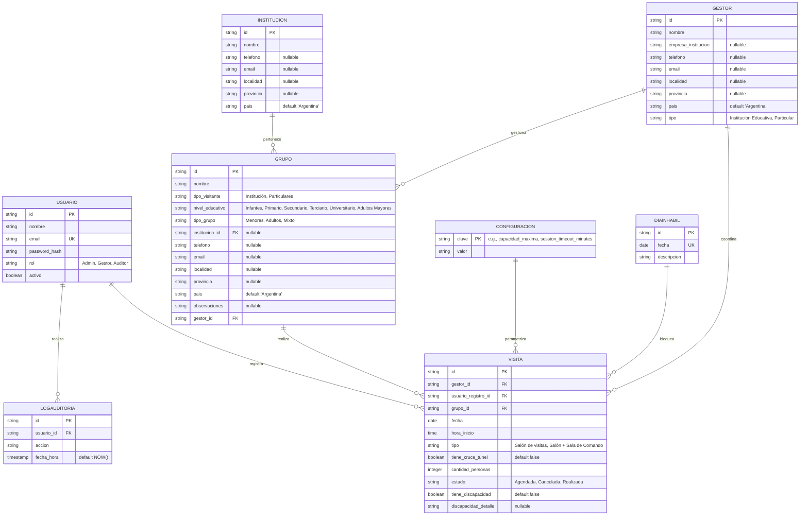

# 📊 Modelo de Datos Real y Actual - Túnel Subfluvial

A partir de la inspección del código fuente del backend (`repositories`, `services`, `migrate.js` y configuraciones de PostgreSQL), se ha reconstruido el modelo de datos **real y actual** del sistema. 

El modelo ha evolucionado significativamente respecto al boceto inicial para dar soporte a reglas de negocio avanzadas, estandarizar convenciones y mejorar la escalabilidad del sistema.

---

## 📈 Diagrama de Entidad-Relación Actualizado (Mermaid)

Este diagrama representa con precisión las tablas, columnas, relaciones y tipos de datos que están implementados y operativos hoy en tu base de datos PostgreSQL:

---

## 🔄 Principales Cambios y Evolución con respecto al Boceto Inicial

### 1. Creación de la Entidad `Institucion` (Nueva)
* **Antes**: No existía. La información escolar se mezclaba de manera ambigua con los grupos.
* **Hoy**: Existe una tabla independiente `Institucion` (`id`, `nombre`, `telefono`, `email`, `localidad`, `provincia`, `pais`). Esto permite registrar escuelas/colegios del país de manera centralizada e independiente de quién sea el gestor o de los grupos específicos que asistan.

### 2. Rediseño Polimórfico de la Entidad `Grupo`
* **Antes**: Era una entidad simple con campos genéricos y dependía únicamente del gestor.
* **Hoy**: Actúa de forma polimórfica según el campo `tipo_visitante`:
  * Si es **`'Institución'`**: Se vincula obligatoriamente a `institucion_id` (FK) y define un `nivel_educativo` (Infantes, Primario, Secundario, etc.).
  * Si es **`'Particulares'`**: Guarda directamente datos de contacto de ese grupo específico (`telefono`, `email`, `localidad`, `provincia`, `pais`) y define el `tipo_grupo` (Menores, Adultos, Mixto).
  * En ambos casos, sigue vinculada a un `gestor_id`.

### 3. Flexibilidad en `Configuracion` (Esquema Key-Value)
* **Antes**: Se planteaba como una tabla con columnas estáticas (`capacidad_maxima`, `duracion_visita_minutos`).
* **Hoy**: Se implementó como un almacén genérico de **Clave-Valor** (`clave` como clave primaria, `valor` como string). Esto permite agregar cualquier nuevo parámetro del sistema dinámicamente sin alterar la base de datos (por ejemplo, `'session_timeout_minutes'` para el control de sesiones).

### 4. Estandarización de Nombres de Claves Foráneas (FK)
* **Antes**: Se usaba el prefijo `id_` (`id_gestor`, `id_usuario_registro`, `id_grupo`).
* **Hoy**: Se adoptó la convención estándar de bases de datos relacionales en snake_case con sufijo `_id` (`gestor_id`, `usuario_registro_id`, `grupo_id`, `institucion_id`).

### 5. Definición Exacta de Tipos, Enums y Accesibilidad
* **Roles de Usuario**: Se estandarizó en `'Admin'`, `'Gestor'`, `'Auditor'` (en lugar de *Guía / Admin*).
* **Tipos de Visita**: Definidos estrictamente como `'Salón de visitas'` o `'Salón + Sala de Comando'` (en lugar de *Complejo/Sala/Descanso*).
* **Estados de la Visita**: Simplificado a `'Agendada'`, `'Cancelada'` y `'Realizada'` (en lugar de *Agendada/En Curso*).
* **Accesibilidad e Integración**: Se agregaron formalmente las columnas `tiene_discapacidad` y `discapacidad_detalle` en `Visita` para cumplir con las políticas de accesibilidad.
* **Ubicaciones Normalizadas**: Se incorporaron campos geográficos (`localidad`, `provincia`, `pais`) en `Gestor`, `Institucion` y `Grupo` para soportar la integración con la API de Georeferenciación.
