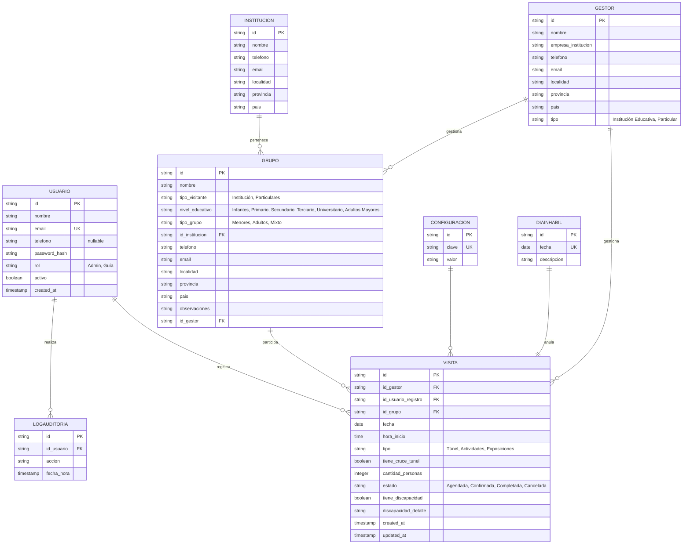

# 📊 Estructura de Base de Datos - Túnel Subfluvial

## Diagrama UML Entidad-Relación

## 📋 Descripción de Tablas

### 1. **USUARIO**
Gestiona los usuarios del sistema
- **Roles**: Admin, Guía
- Autenticación por email/password
- Datos de contacto propios: `email` y `telefono` (editables por el propio usuario desde su perfil)
- Control de activación/desactivación (el Admin puede desactivar y reactivar cuentas)

### 2. **GESTOR**
Personas/instituciones que coordinan visitas
- Datos de contacto y ubicación
- Tipo de gestor (Institución educativa o Particular)

### 3. **INSTITUCION**
Instituciones educativas que visitan el túnel
- Información de contacto
- Ubicación geográfica

### 4. **GRUPO**
Agrupa visitantes bajo un mismo coordinador
- Puede ser una institución o grupo de particulares
- Contiene: nivel educativo, tipo de grupo (menores/adultos/mixto)
- Relación con Gestor e Institución

### 5. **VISITA**
Evento de visita al túnel
- Fecha, hora y tipo de visita
- Cantidad de personas
- Control de discapacidades
- Validación de aforo (cantidad_personas)
- Estados: Agendada, Confirmada, Completada, Cancelada
- Registra al usuario que crea la visita

### 6. **DIAINHABIL**
Fechas cerradas para visitas
- Reutilización del mismo día inhabilita todas las visitas
- Cada fecha se puede registrar una sola vez

### 7. **CONFIGURACION**
Parámetros globales del sistema
- Capacidad máxima (aforo): 300 personas por día
- Otros parámetros configurables

### 8. **LOGAUDITORIA**
Registro de todas las acciones en el sistema
- Quién realizó la acción
- Qué acción realizó
- Cuándo se realizó

## 🔗 Relaciones Principales

| Relación | Tipo | Descripción |
|----------|------|-------------|
| Usuario → Visita | 1:N | Un usuario registra muchas visitas |
| Gestor → Visita | 1:N | Un gestor puede coordinar muchas visitas |
| Gestor → Grupo | 1:N | Un gestor coordina múltiples grupos |
| Institución → Grupo | 1:N | Una institución puede tener múltiples grupos |
| Grupo → Visita | 1:N | Un grupo realiza múltiples visitas |
| Usuario → LogAuditoria | 1:N | Un usuario realiza múltiples acciones |

## ⚙️ Validaciones en BD

1. **Aforo**: Máximo 300 personas por día
2. **Disponibilidad**: No se pueden registrar visitas en días inhabiles
3. **Solapamiento**: No pueden haber dos visitas en la misma hora
4. **Tipos**: Validación de ENUM para tipos de visita, estado, rol, etc.
