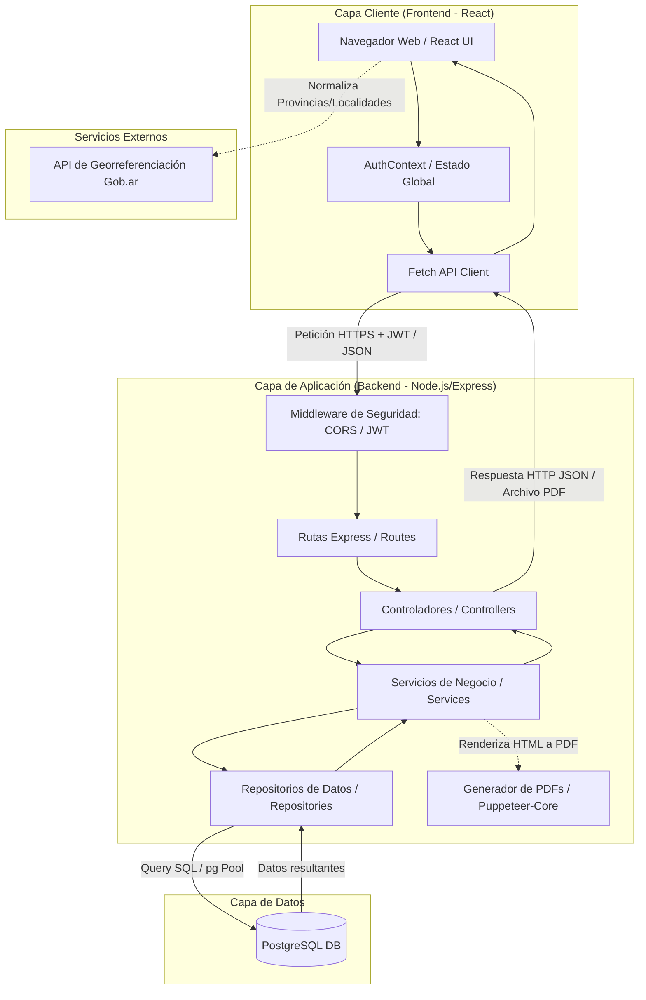
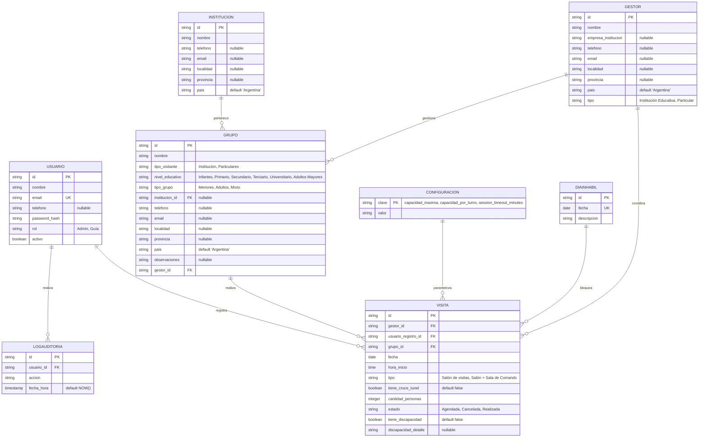
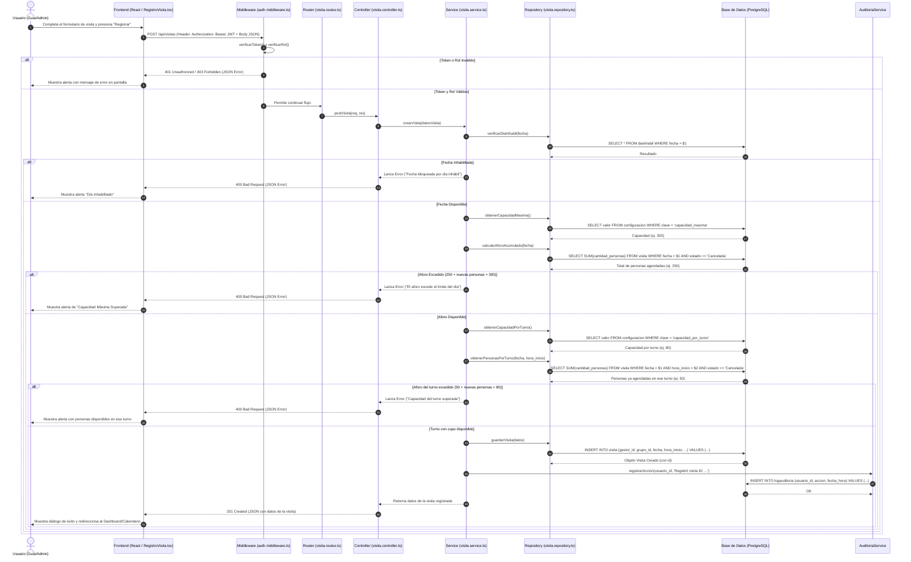

# 🏛️ Arquitectura General del Sistema — Gestión de Visitas (Túnel Subfluvial)

Este documento describe la arquitectura de software del **Sistema de Gestión de Visitas del Túnel Subfluvial**, detallando el diseño técnico, la separación de responsabilidades en capas y cómo interactúan las tecnologías principales del stack: **React (Frontend)**, **Node.js/Express (Backend)** y **PostgreSQL (Base de Datos)**.

---

## 1. 🗺️ Diagrama de Arquitectura de Alto Nivel

El sistema sigue una arquitectura cliente-servidor desacoplada. A continuación se presenta el flujo general de comunicación entre los componentes del sistema:



---

## 2. 💻 Capa Cliente (Frontend - React)

El frontend está desarrollado sobre **React 18** utilizando **TypeScript** y compilado con **Vite**. La interfaz está estilizada usando **Tailwind CSS** para un diseño moderno y responsivo.

### Organización de Código
* **`src/pages/`**: Páginas principales del sistema (`Dashboard`, `Calendario`, `RegistroVisita`, `Auditoria`, etc.) que gestionan el estado local de los formularios y la renderización de las vistas.
* **`src/components/`**: Componentes UI reutilizables (botones, tablas, diálogos interactivos, componentes de gráficos para estadísticas).
* **`src/context/`**: Manejo del estado global. Contiene el `AuthContext.tsx`, que controla la sesión del usuario, almacena el token JWT en el `localStorage`, intercepta la inactividad del usuario para el cierre automático de sesión (`session_timeout_minutes`) y expone los datos del usuario logueado.
* **`src/utils/`**: Funciones auxiliares y definiciones de tipos estáticos (`visitaTypes.ts`).

### Comunicación con el Backend
El frontend se comunica con el servidor de forma asíncrona a través de la **Fetch API** de JavaScript utilizando variables de entorno (`import.meta.env.VITE_API_URL`) para definir la dirección del servidor. 

> [!NOTE]
> Todas las peticiones HTTP que requieren autorización adjuntan el token JWT guardado localmente en las cabeceras de la petición:
> `headers: { 'Authorization': 'Bearer <Token_JWT>' }`

---

## 3. ⚙️ Capa de Aplicación (Backend - Node.js + Express)

El backend está desarrollado en **Node.js** con **TypeScript**, estructurado sobre el framework web **Express**. Sigue un patrón de arquitectura limpia dividida en **4 capas principales de responsabilidad**:

```
[Cliente] ──> [Middleware (JWT)] ──> [Routes] ──> [Controllers] ──> [Services] ──> [Repositories] ──> [PostgreSQL]
```

### Capas del Backend
1. **Middlewares (`src/middleware/`)**:
   * **`auth.middleware.ts`**: Intercepta las solicitudes entrantes, extrae el token JWT del encabezado `Authorization`, lo verifica usando la clave secreta y almacena los datos decodificados en el objeto de la petición (`req.usuario`). Adicionalmente valida si el rol del usuario posee los permisos adecuados (`verificarRol`).
2. **Rutas (`src/routes/`)**:
   * Define los endpoints del sistema (ej. `/api/visitas`, `/api/usuarios`, `/api/gestores`). Asocia cada ruta con su respectivo controlador y le aplica los middlewares de autenticación necesarios.
3. **Controladores (`src/controllers/`)**:
   * Actúan como puntos de entrada de la petición HTTP. Extraen datos de la URL (`req.params`), de la query string (`req.query`) o del cuerpo (`req.body`), delegan la lógica de negocio a los servicios correspondientes y devuelven la respuesta en formato JSON con el código de estado HTTP adecuado.
4. **Servicios (`src/services/`)**:
   * Contienen toda la lógica de negocio y reglas operativas del sistema (ej. cálculo de estadísticas, verificación de aforo acumulado, validación de solapamiento de horas, etc.). 
   * Es una capa agnóstica del protocolo de transporte (no sabe que existe HTTP).
   * **`export.service.ts`**: Utiliza `puppeteer-core` y `@sparticuz/chromium` para levantar un navegador headless, renderizar una plantilla HTML en memoria e imprimirla en formato PDF (utilizado para comprobantes individuales de visitas y reportes estadísticos).
5. **Repositorios (`src/repositories/`)**:
   * Encapsulan las operaciones directas de lectura y escritura en la base de datos PostgreSQL. Utilizan consultas SQL parametrizadas nativas para máxima performance y seguridad contra inyección de SQL.

---

## 4. 🗄️ Capa de Datos (Base de Datos - PostgreSQL)

La persistencia de datos está delegada en **PostgreSQL**. La conexión se realiza a través de un pool gestionado por el driver de Node `pg` (`Pool`), optimizando la reutilización de conexiones TCP.

### Diagrama Entidad-Relación (Base de Datos Real)



### Reglas de Negocio Implementadas en Consultas del Backend

Todas las validaciones de disponibilidad están centralizadas en `AvailabilityService` (`disponibilidad.service.ts`) y se ejecutan en el siguiente orden antes de aceptar cualquier registro o modificación de visita:

* **Aforo Diario** (`capacidad_maxima`): El backend suma todas las personas agendadas para la fecha (`SELECT SUM(cantidad_personas) ... WHERE fecha = $1 AND estado != 'Cancelada'`). Si agregar el nuevo grupo supera el límite diario configurado en `CONFIGURACION` (por defecto 300 personas), la solicitud es rechazada.

* **Días Inhábiles**: El validador cruza la fecha de la visita contra la tabla `DIAINHABIL`. Si existe un registro coincidente, la visita es rechazada automáticamente, independientemente del aforo disponible.

* **Aforo por Turno** (`capacidad_por_turno`): **Múltiples grupos pueden compartir el mismo turno horario** (misma `fecha` + `hora_inicio`). El backend suma las personas ya agendadas en ese turno específico y verifica que agregar el nuevo grupo no supere el límite por turno configurado en `CONFIGURACION` (por defecto 80 personas/turno). Esta regla reemplaza al antiguo bloqueo de "solapamiento horario" que impedía registrar más de una visita por slot.

* **Baja Lógica**: Los usuarios del sistema no son eliminados físicamente para no romper la integridad referencial de los logs de auditoría; en su lugar, se gestionan a través del campo booleano `activo`.

---

## 5. 🔄 Flujo de una Petición Común: Registro de una Visita

El siguiente diagrama de secuencia detalla cómo viaja la información entre los distintos componentes y capas al registrar una nueva visita guiada (CU-003):



---

## 6. 👥 Múltiples Grupos por Turno

Desde la versión actual, el sistema permite registrar **más de un grupo en el mismo turno horario** (misma `fecha` + `hora_inicio`). Esta funcionalidad reemplaza al antiguo control de solapamiento que bloqueaba cualquier segundo intento de agendado en el mismo slot.

### Modelo de Capacidad por Turno

El sistema ahora maneja **dos niveles de cupo independientes**:

| Nivel | Parámetro en BD | Descripción | Default |
|-------|----------------|-------------|--------|
| Diario | `capacidad_maxima` | Tope total de personas en el día (suma de todos los turnos) | 300 |
| Por Turno | `capacidad_por_turno` | Tope de personas en un mismo slot `fecha + hora_inicio` | 80 |

Ambos parámetros son configurables en tiempo real desde la página **Configuraciones del Sistema**, y cada cambio queda registrado automáticamente en el log de auditoría.

### Comportamiento en el Dashboard

El cronograma operativo del Dashboard fue actualizado para reflejar esta realidad:

* Los slots con **un solo grupo** se muestran como antes.
* Los slots con **múltiples grupos** muestran una cabecera con el badge `N grupos`, las personas ocupadas y el cupo restante del turno.
* Dentro de cada slot, cada grupo se lista en su propia fila con sus acciones individuales (marcar como realizada, ver detalle).
* Si el turno aún tiene cupo disponible, aparece el botón **"Agregar grupo"** directamente en la cabecera del slot.
* Si el cupo del turno se agotó, el botón no se muestra y se indica `lleno`.

### Impacto en Auditoría y Estadísticas

* Cada grupo registrado en un turno genera su **propia fila** en la tabla `VISITA` y su propio registro en `LOGAUDITORIA`.
* Las estadísticas, el Listado de Visitas y el Calendario siguen contabilizando por visita individual, por lo que múltiples grupos se suman automáticamente sin cambios en esas capas.
* El Calendario mensual muestra el **total de grupos** y **total de personas** por día, incluyendo todos los grupos de todos los turnos de ese día.

---

## 7. 🔒 Seguridad y Auditoría

La seguridad es transversal a toda la aplicación y se gestiona bajo los siguientes estándares:

* **Protección contra Inyecciones SQL**: Ninguna consulta concatena strings en backend. Todos los parámetros se introducen de manera aislada usando queries parametrizadas (ej: `$1, $2, ...` en el driver `pg`).
* **Hasheado de Contraseñas**: Las claves de los usuarios jamás se guardan en texto plano en la base de datos. Se utiliza la biblioteca **bcryptjs** en `UsuarioService` para generar y comparar los hashes de forma segura con un factor de costo elevado.
* **Control de Sesiones**: En cada inicio de sesión exitoso, el backend emite un token JWT conteniendo el `id`, `email` y `rol` del usuario. Este token tiene un tiempo de expiración dinámico gestionado a través de la clave `session_timeout_minutes` de la base de datos.
* **Pistas de Auditoría Inmutables**: El backend fuerza el registro automático de logs para cualquier acción que modifique el estado del sistema. Cada controlador invoca a `AuditoriaService` al realizar modificaciones, insertando una fila en la tabla `LOGAUDITORIA` asociando la fecha y hora exacta (`NOW()`), la acción descrita y el ID del usuario responsable.
